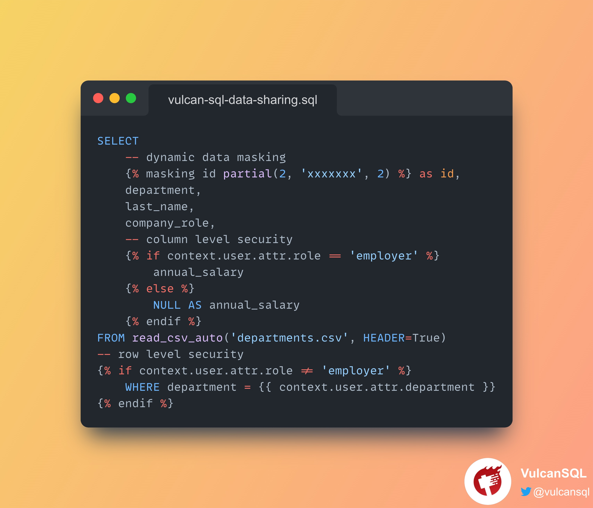

---
authors:
    name: Jimmy Yeh
    title: core member of VulcanSQL
    url: https://github.com/cyyeh
    image_url: https://avatars.githubusercontent.com/u/11023068?v=4
    email: jimmy.yeh@cannerdata.com
---

# Data Privacy Mechanisms provided by VulcanSQL for Easier Data Sharing



## What is data sharing and why it's important?

Data sharing is a behavior that we share data to other parties 
which maybe other departments in the same company, or customers outside the company, etc.
The reason why we agree to share data is that we finally realize data is a valuable asset 
especially to business, since it can make the business process more smooth and enable better decision making results!

When thinking about how to share data with others, there are some common requirements coming up to our minds, such as 
what are the formats of data being stored, what kind of storage should persist the data, and how to share data with other parties. 
However, there are also other directions we need to consider and I would like to discuss data privacy with you in this article.

## Why data privacy is important to data sharing?

In terms of sharing data with others, there are certainly some scenraios that we can treat everyone we share with equally.
<!--truncate-->
For example, datasets found in Kaggle competitions are normally the same to all competition participants.
However, in the business world, we should especially obey the principle of least privilege(PoLP). It's an information security concept which maintains that a user 
or entity should only have access to the specific data, resources and applications needed to complete a required task[^1].

Given that we understand data sharing is a great opportunity to share valuable resources with others, 
and we also realize we need to control how different parts of data can be accessed from different parties. 
Now the question comes to how do we share data with others in a more contrallable way that can fulfill the data privacy requirement?


## How VulcanSQL can help?

VulcanSQL comes with several built-in data privacy mechanisms to enable a more controllable and scalable data sharing use case!

As of now, VulcanSQL has 5 techniques for handling data privacy, here are some brief introduction to each technique and [in the
Showcase section](#showcase), we'll show you the code and explain further accordingly.

### Authentication

Authentication is the first layer of data privacy protection. Any entity that is not authenticated is not allowed to access any resources.
At the moment, VulcanSQL only accepts three authentication methods, namely [HTTP Basic](../docs/data-privacy/authn#http-basic), 
[password file](../docs/data-privacy/authn#password-file) and [simple token](../docs/data-privacy/authn#simple-token). Since we realize there should be
a more mature and easy way for users to authenticate, we plan to support OpenID Connect in the future.

:::info
You can understand more about [the authentication mechanism in VulcanSQL here](../docs/data-privacy/authn)!
:::

### Authorization

With authorization, VulcanSQL applies an attribute-based access control(ABAC) approach to control access 
based on user attributes provided by Authenticator. In VulcanSQL, we can configure each user's attributes in `vulcan.yaml`;
then we can define different policies for different users based on their attributes for each data source in `profiles.yaml`.
With this mechanism, different users would see different parts of the data based on their attributes defined in VulcanSQL!

:::info
You can understand more about [the authorization mechanism in VulcanSQL here](../docs/data-privacy/authz)!
:::

### Dynamic Data Masking

Sometimes, we want to share masked data to users. The purpose is to protect the actual data while having a functional substitute 
for occasions when the real data is not required!

With dynamic data masking, we can define a specific pattern for masking the real data, such as transforming an ID from F123456789 to F12xxxx89
using a `partial(3, 'xxxx', 2)` function.

:::info
You can understand more about [the dynamic data masking mechanism in VulcanSQL here](../docs/data-privacy/data-masking)!
:::

### Column-level Security

If we need to have fine grained control over some specific columns, we can use the Column-level Security(CLS) mechanism to achieve the goal.
In VulcanSQL, we can decide who can access the specific column based on their user attributes.

:::info
You can understand more about [the column-level security mechanism in VulcanSQL here](../docs/data-privacy/cls)!
:::

### Row-level Security

Similar to the case of Column-level Security, if we need to have fine grained control over some specific rows, we can use the Row-level Security(RLS) mechanism to achieve the goal.
In VulcanSQL, we can decide who can access the specific row based on their user attributes.

:::info
You can understand more about [the row-level security mechanism in VulcanSQL here](../docs/data-privacy/rls)!
:::

## Showcase

Now we are going to show you the code to demonstrate how you can deliver data privacy mechanisms in SQL templates!
If you would like to read the source code or try the example by yourself, 
welcome to [check it out here](https://github.com/Canner/vulcan-sql-examples/tree/main/data-sharing)!

Below is the sample dataset we'll use in the showcase:

|id|department|last_name|company_role|annual_salary|
|---|---|---|---|---|
|JDK32424|engineering|James|engineer|"$100,000"|
|EKJ34124|sales|Harden|sales|"$120,000"|
|MKO56124|sales|Michael|manager|"$110,000"|
|ONP01124|engineering|Cindy|manager|"$115,000"|
|NZP59124|ceo|Rosa|boss|"$150,000"|

Below is the code you may write in SQL templates in VulcanSQL:

```sql
SELECT
    -- dynamic data masking
     as id,
    department,
    last_name,
    company_role,
    -- column level security
    
        annual_salary
    
        NULL AS annual_salary
    
FROM read_csv_auto('departments.csv', HEADER=True)
-- row level security

    WHERE department = {{ context.user.attr.department }}

```

Here is the `auth` configuration in `vulcan.yaml`:

```yaml
auth:
  enabled: true
  options:
    basic:
      # Read users and passwords from a text file.
      htpasswd-file:
        path: passwd.txt # Path to the password file.
        users: # (Optional) Add attributes for users
          - name: james
            attr:
              role: employee
              department: engineering
          - name: harden
            attr:
              role: employee
              department: sales
          - name: michael
            attr:
              role: employee
              department: sales
          - name: cindy
            attr:
              role: employee
              department: engineering
          - name: rosa
            attr:
              role: employer
              department: ceo
```

The REST API results you'll see based on different users:

**James**

|id|department|last_name|company_role|annual_salary|
|---|---|---|---|---|
|JDxxxxxxx24|engineering|James|engineer||	
|ONxxxxxxx24|engineering|Cindy|manager||

**Harden**

|id|department|last_name|company_role|annual_salary|
|---|---|---|---|---|
|EKxxxxxxx24|sales|Harden|sales||	
|MKxxxxxxx24|sales|Michael|manager||

**Michael**

|id|department|last_name|company_role|annual_salary|
|---|---|---|---|---|
|EKxxxxxxx24|sales|Harden|sales||	
|MKxxxxxxx24|sales|Michael|manager||

**Cindy**

|id|department|last_name|company_role|annual_salary|
|---|---|---|---|---|
|JDxxxxxxx24|engineering|James|engineer||	
|ONxxxxxxx24|engineering|Cindy|manager||

**Rosa**

|id|department|last_name|company_role|annual_salary|
|---|---|---|---|---|
|JDxxxxxxx24|engineering|James|engineer|$100,000|
|EKxxxxxxx24|sales|Harden|sales|$120,000|
|MKxxxxxxx24|sales|Michael|manager|$110,000|
|ONxxxxxxx24|engineering|Cindy|manager|$115,000|
|NZxxxxxxx24|ceo|Rosa|boss|$150,000|

After observing the result tables shown above and the given SQL templates,
we can clearly figure out several data privacy mechanisms provided by VulcanSQL:

1. Authentication: In the above example, we used HTTP Basic as the authentication method 
and the password of each user was stored in a text file called `passwd.txt`.
2. Authorization: You can find that we had defined user attributes in `vulcan.yaml`.
With these user attributes defined, we can have more fine grained control on what kind of data
each user should access.
3. Dynamic Data Masking: ` as id` makes only the first two and
last two digits of id visible, and the rest is masked.
4. Column-level Security: We can see that only the user who is in the employer role can see the salary field, 
so Rosa is the only one in this role.
5. Row-level Security: We can see a user who is not in the employer role can only see the data
in the same department as he/she.

## Conclusion

Data privacy is more important than ever. We may regard it as a special kind of human rights, 
so we should protect the data from being abused!

We hope this blog post effectively highlights the significance of data privacy when sharing data with other parties.
It also showcases that VulcanSQL offers user-friendly solutions that are certainly worth exploring.

[^1]: The definition of the principle of least privilege(PoLP) is referenced from the [article from paloalto networks](https://www.paloaltonetworks.com/cyberpedia/what-is-the-principle-of-least-privilege#:~:text=The%20principle%20of%20least%20privilege%20(PoLP)%20is%20an%20information%20security,to%20complete%20a%20required%20task.).