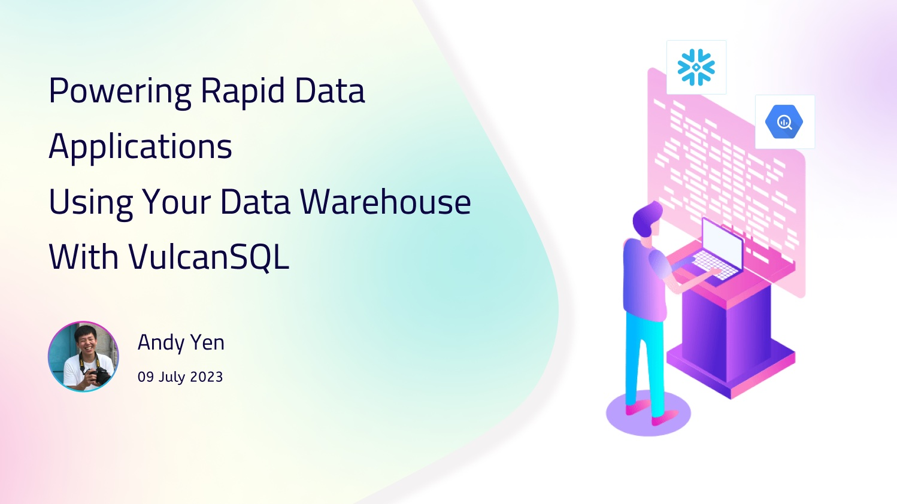

---
authors:
  name: Andy Yen
  title: core member of VulcanSQL
  url: https://github.com/onlyjackfrost
  image_url: https://avatars.githubusercontent.com/u/38731840?v=4
  email: andy.yen@cannerdata.com
---

# Powering Rapid Data Applications Using Your Data Warehouse With VulcanSQL



Hello, data folks.

Are you building a data application using your data warehouse, be it customer-facing analytics, externally shared APIs, or in-house tools like an admin panel, and finding yourself entangled with latency and cost problems? If so, you've come to the right spot!

## What Are the Challenges ?
When it comes to building data applications on top of your data warehouse, several obstacles can get in the way. Here are the primary obstacles you might come across:

1. **High Query Latency**:
Customer-facing applications require speedy responses, often within milliseconds. Traditional data warehouses, however, are optimized for analytical workloads, which might lead to slow query responses that could negatively impact your application's user experience.

2. **Security Concerns**:
In a world where data breaches are all too common, implementing an application-specific security layer is vital. This is especially important for multi-tenant environments where each user must access only their own data.

3. **Cost Considerations**:
The scalability of your applications to serve a large number of concurrent users can bring about cost challenges. As the user base grows, the associated cost of managing a data warehouse might skyrocket. Striking a balance between scalability and cost can be quite a struggle.

<!--truncate-->
## Meet VulcanSQL

**VulcanSQL, a data API framework built specifically for data applications**, empowers data professionals to generate and distribute data APIs quickly and effortlessly. It takes your SQL templates and transforms them into data APIs, with no backend expertise necessary.

One of the defining attributes of VulcanSQL is its strategic use of DuckDB's exceptional capabilities as a caching layer. This synergistic pairing permits VulcanSQL to deliver low-latency APIs, presenting an optimal solution for scenarios where traditional data warehouses may fall short.

By utilizing VulcanSQL, you can move remote data computing in cloud data warehouses, such as Snowflake and BigQuery to the edge. This embedded approach ensures that your analytics and automation processes can be executed efficiently and seamlessly, even in resource-constrained environments.

**Visualize a typical use case, where you, a data engineer or analytics engineer, regard the historical data in your data warehouse as "cold data" and store the data frequently accessed or relevant to the application within VulcanSQL as "hot data".**

Now, let's see how straightforward it is to write a VulcanSQL API.

## Crafting a Data API
Let's assume we are creating an API that will provide the daily revenue for the past three years.

For instance, I will set up a VulcanSQL server and use BigQuery as the data warehouse with **[TPC-H](http://www.tpc.org/tpch/)** SF1 data within. We need to handle two things first, but I won't delve into the specifics here.
- **Project configuration**: Establish project-related configurations. For more information, visit: **https://vulcansql.com/docs/api-plugin/overview**
- **Connecting to a data source**: For more details, visit **https://vulcansql.com/docs/connectors/overview**. We support BigQuery, Snowflake, PostgreSQL, and Clickhouse.

**Now let's dive into the most critical aspect - writing our APIs.**

### Step 1. Crafting APIs with SQL Templates

After **[initializing](https://vulcansql.com/docs/develop/init)** your VulcanSQL project, we can begin constructing your API using SQL templates. Let's develop a **`daily_revenue.sql`** file, which contains the main business logic of the API, all written in SQL.

As an example, I'll create an API that responds with the daily revenue for a specific period.

```sql

select
  *
from daily_revenue
  where orderdate >= {{ context.params.startdate }}
  and orderdate <= {{ context.params.enddate }}

```

- Fetching from Cache: The **` ... `** directive fetches data from the DuckDB caching layer.
- Dynamic Parameter: **`context.params.xxx`** stands for the values acquired from the query parameters. VulcanSQL uses your template to furnish users with data they specify via parameters.

### Step 2. Configuring your API

Next, let's develop a **`daily_revenue.yaml`** file to configure your API.

```yaml
urlPath: /daily_revenue
cache:
- cacheTableName: daily_revenue
  sql: "select sum(totalprice), orderdate from cannerflow-286003.tpch_sf1.orders where orderdate >= '1996-01-01' group by orderdate "
  profile: bq
  refreshTime:
      every: "1d"
profile: bq
```

Here we've defined an API with the path **`/daily_revenue`**. In the **`cache`** settings, we specific following configurations:
* **`cacheTableName`**: The name of the table in DuckDB that will store the cached data.
* **`sql`**: The SQL query that will be executed to extract data from BigQuery.
* **`refreshTime`**: The frequency at which the cache will be refreshed. In this case, it's daily.
* **`profile`**: We created a BigQuery profile in the project configuration step. Here, we specify the profile to use. Check out the **[Connecting to Data Sources](https://vulcansql.com/docs/connectors/overview)** for more information.

Once you start the VulcanSQL server, it syncs data from BigQuery to DuckDB for caching and then serves it at the **`/daily_revenue`** endpoint.

## Performance Evaluation

In this scenario, we've extracted aggregated data from the data warehouse and transformed a SQL template into Data APIs using VulcanSQL. Now, let's assess the performance of VulcanSQL.

To evaluate if VulcanSQL could serve as a low-latency data API, especially in handling multiple concurrent requests, I conducted a series of load tests using **[k6.io](https://k6.io/)**.

Here's a look at a basic request. The load test was run for a span of 30 seconds. For a concurrency level of 1 and 10, VulcanSQL managed to handle the load within an impressive 100 milliseconds!

```
# concurrent 1, ran for 30 sec
med 9ms
p(95) 13ms

# concurrent 10, ran for 30 sec
med 48ms
p(95) 71ms
```

Even at a concurrency level of 100, VulcanSQL kept the response times within 500ms.

```
# concurrent 50, ran for 30 sec
med 223ms
p(95) 267ms

# concurrent 100, ran for 30 sec
med 422ms
p(95) 492ms
```

And with 300 concurrent users, the response time managed to serve within approximately a second, still showing impressive scalability.

```
# concurrent 300, ran for 30 sec
med 1.0s
p(95) 1.3s
```

All our source code is available on **[Github](https://github.com/Canner/vulcan-sql-examples/tree/main/daily-revenue)**. Feel free to check it out!

## Summary

In today's data-driven world, businesses rely heavily on their data warehouses. These rich repositories serve as the backbone for collecting and processing tons of data, turning raw numbers into valuable insights.

However, as more and more organizations look to build data applications atop these data warehouses, a new need arises - the need for a robust data API framework. This framework should be designed to overcome traditional obstacles like high query latency, security concerns, and cost issues, enabling organizations to fully leverage their data and drive their operations to new heights.

Are you ready to step up your data application game with VulcanSQL? Check out our quickstart guide **[here](https://vulcansql.com/docs/get-started/first-api)** and embark on a journey towards more efficient, secure, and cost-effective data applications.

:::info
We have a [Discord community](https://discord.gg/ztDz8DCmG4) and welcome to ask us anything or give us feedback! Also, we definitely welcome you to share interesting projects you've done using VulcanSQL in [#showcase](https://discord.com/channels/1017514410677391420/1017514410677391427) channel!

Finally, if VulcanSQL resonates with you, please consider starring us on GitHub!
:::
