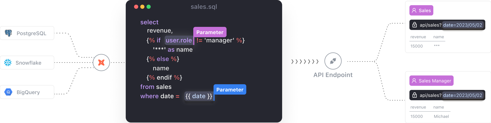
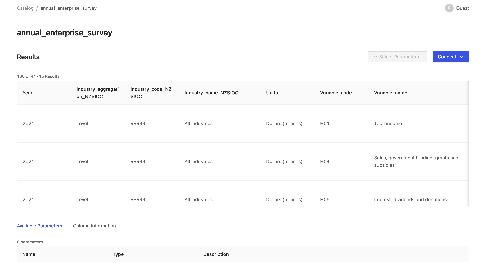

# Query Data from the Internet and Deliver APIs in no time

*TLDR: VulcanSQL, a free and open-source data API framework built specifically for data applications, 
empowers data professionals to generate and distribute data APIs quickly and effortlessly. 
It takes your SQL templates and transforms them into data APIs, with no backend expertise necessary.*

## One Way to Understand APIs

As an API designer, we can think of APIs composed of three components, namely **input**, **transformation** and **output**.

Let's start with the input component, we need to consider what are data sources of APIs. Generally, data sources 
can be databases, files on the FTP server, etc. After we decide what data sources our APIs support, we need to
also support different mechanisms in order to get data from data sources.

Then, with the transformation part, it generally is where we handle business logic. Finally, the output part means the destination
of the APIs and also the mechanisms we deliver the APIs, such as RESTful APIs, GraphQL, etc.

Now, let me take VulcanSQL as a quick example, it emphasizes you can write SQL templates in the transformation part, 
and it currently supports RESTful APIs for the output part. As of the input, please read the following content to grasp the full story! 



<!--truncate-->

## The Input Part: Data Sources

VulcanSQL aims to help data professionals create and deliver data APIs in an easy way! 
Originally, VulcanSQL supports data warehouses and some databases such as [BigQuery](../docs/connectors/bigquery), 
[Snowflake](../docs/connectors/snowflake), [ClickHouse](../docs/connectors/clickhouse) and [PostgreSQL](../docs/connectors/postgresql), etc. However, as we share VulcanSQL to the world 
along the way, we figured out that there are also lots of data on the Internet that is not in databases 
such as CSV files or data that lives in other people's databases!

That's what we're going to share with you next: how VulcanSQL can help you get data from the Internet! 

## How VulcanSQL can help?

As of now, VulcanSQL provides two mechanisms to help you get data from the Internet.

### DuckDB and its httpfs extension

In VulcanSQL, we can use [DuckDB](../docs/connectors/duckdb) as a caching layer to [enhance query performance](./powering-rapid-data-apps-with-vulcansql), or as a data connector. 
For those of you who may not be familiar with DuckDB, it is a high performance in-process OLAP database, 
and has lots of extensions available! In order to get data from the Internet, VulcanSQL supports the httpfs extension!

With the [httpfs extension](https://duckdb.org/docs/extensions/httpfs.html), now VulcanSQL can query CSV, JSON and Parquet files from the Internet!

Imagine now you find some interesting dataset on the Internet, and it's a CSV file! Now you can directly query it
like the following SQL statement, then you can do some data transformation using SQL, and deliver APIs right away to share with others!

```sql
SELECT 
  *
FROM 'https://www.stats.govt.nz/assets/Uploads/Annual-enterprise-survey/Annual-enterprise-survey-2021-financial-year-provisional/Download-data/annual-enterprise-survey-2021-financial-year-provisional-csv.csv'
```

The image below shows the data details using VulcanSQL's [API Catalog feature](../docs/catalog/intro)


If you would like to read the source code of the full example, please [check out here](https://github.com/Canner/vulcan-sql-examples/tree/main/read-data-from-internet)!

### The API Extension

Sometimes, you may find some interesting data from RESTful APIs created by others. VulcanSQL now has [the API extension](../docs/extensions/api) that
allows you to query data from 3rd parties using RESTful APIs!

In the following example, we call the RESTful API to `https://dummyjson.com` and search their products with a query string!

```sql

SELECT {{ a_variable_you_can_define | rest_api(url='https://dummyjson.com/products/search') }}
```

Besides, the API Extension not only supports the GET method, but also other HTTP methods as well!

If you would like to read the source code of the full example, please [check out here](https://github.com/Canner/vulcan-sql-examples/tree/main/restapi-caller).

## Conclusion

We hope this blog post demonstrates how VulcanSQL can help you query data from the Internet, thus you can create and deliver APIs in no time!
