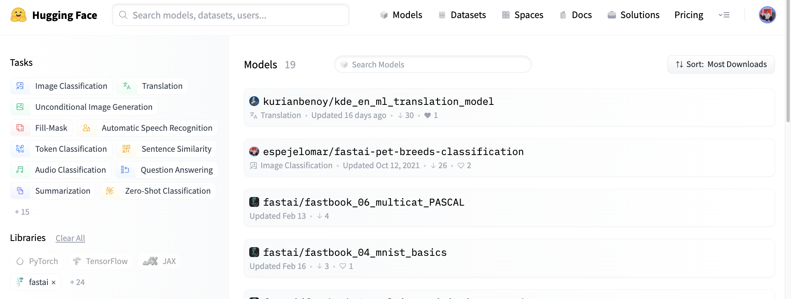
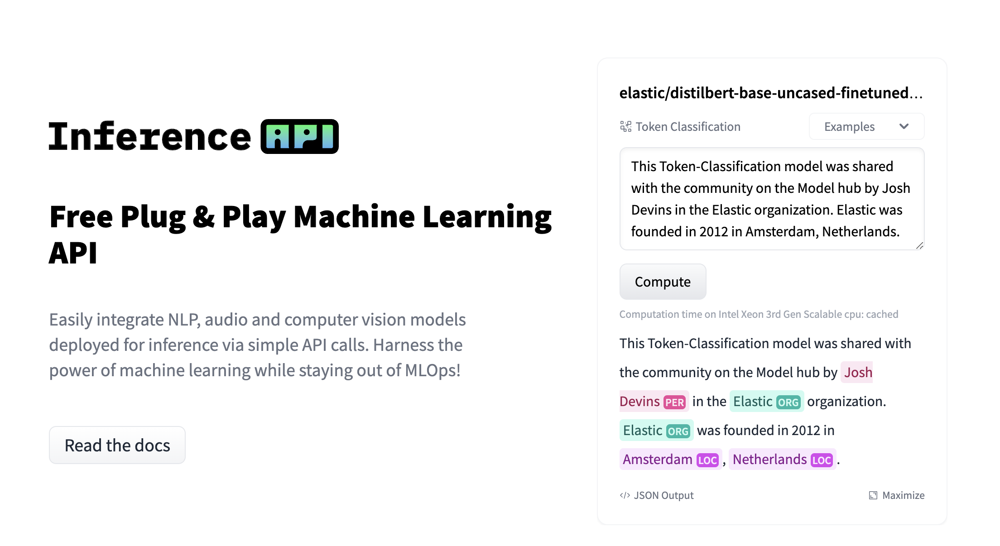
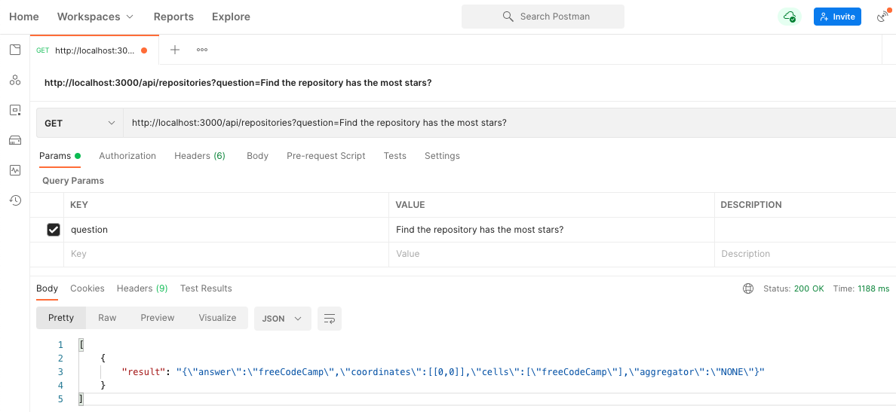
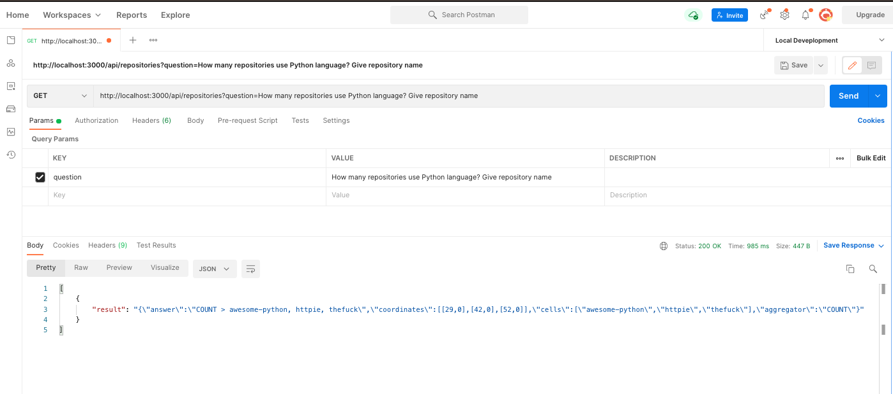
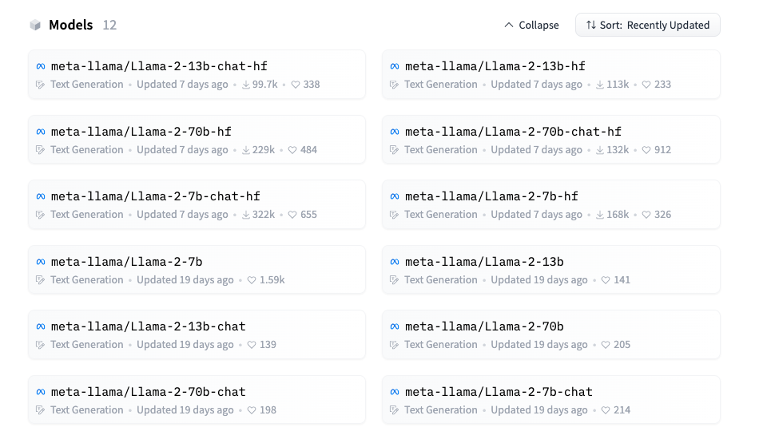
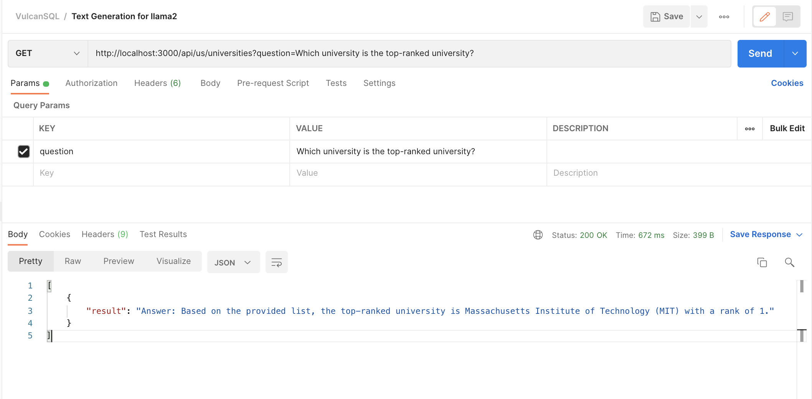
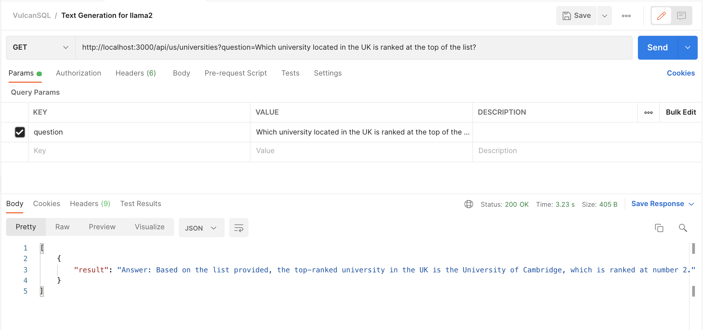

# Querying Your Data Easily and Smartly through Hugging Face


*TLDR: VulcanSQL, a free and open-source data API framework built specifically for data applications, 
empowers data professionals to generate and distribute data APIs quickly and effortlessly. 
It takes your SQL templates and transforms them into data APIs, with no backend expertise necessary.*

## Preface

Normally, in order to retrieve the data we need from a data source, 
we have to write SQL statements. However, this process could be **time-consuming** 
especially when the data consumers have different requirements in short time. 
Now, to make this process easier and more flexible to data consumers, 
VulcanSQL has **integrated HuggingFace inference capabilities**. This allows us to **reduce 
the need for changing SQL templates** by simply allowing data consumers to ask questions 
and getting the results they need.

<!--truncate-->

## VulcanSQL HuggingFace Filters

VulcanSQL leverages the Hugging Face Inference feature through the VulcanSQL 
[Filters](https://vulcansql.com/docs/develop/advanced#filters) statement.

### What is Hugging Face

Hugging Face is an AI community that builds tools to enable users to build, train, 
and deploy machine learning models. Hugging Face makes it easy to share tools, models, 
model weights, and datasets among other practitioners through its toolkit.



Hugging Face provides the [Inference API](https://huggingface.co/inference-api) feature 
that allows users to run pre-trained AI models for various natural language processing (NLP) 
tasks, making it easier to integrate powerful language models into applications and services.



### Table Question Answering Task Filter

"[Table Question Answering](https://huggingface.co/tasks/table-question-answering)" is one of 
the NLP (Natural Language Processing) tasks provided by Hugging Face. Table Question Answering 
involves answering a question about the information in a given table. It allows for simulating SQL 
execution by inputting a table through its model.

VulcanSQL currently integrates the table question answering feature by creating the filter named 
`huggingface_table_question_answering` and allows you to apply functions to variables using the 
pipe operator (`|`).

**Sample 1 - send the data from the variable [`set` tag](https://www.notion.so/VulcanSQL-edb87d04de074125ab19275e6f63d844?pvs=21):**

You could give the dataset with the **[`set` tag](https://www.notion.so/VulcanSQL-edb87d04de074125ab19275e6f63d844?pvs=21)**
and give the question with the `query` field:

```sql
{% set data = [
  {
    "repository": "vulcan-sql",
    "topic": ["analytics", "data-lake", "data-warehouse", "api-builder"],
    "description":"Create and share Data APIs fast! Data API framework for DuckDB, ClickHouse, Snowflake, BigQuery, PostgreSQL"
  },
  {
    "repository": "accio",
    "topic": ["data-analytics", "data-lake", "data-warehouse", "bussiness-intelligence"],
    "description": "Query Your Data Warehouse Like Exploring One Big View."
  },
  {
    "repository": "hello-world",
    "topic": [],
    "description": "Sample repository for testing"
  }
] %}

-- The source data for "huggingface_table_question_answering" needs to be an array of objects.
SELECT {{ data | huggingface_table_question_answering(query="How many repositories related to data-lake topic?") }} as result
```

Here is a response returned by `huggingface_table_question_answering`:

```json
[
  {
    "result": "{\"answer\":\"COUNT > vulcan-sql, accio\",\"coordinates\":[[0,0],[1,0]],\"cells\":[\"vulcan-sql\",\"accio\"],\"aggregator\":\"COUNT\"}"
  }
]
```

The result will be converted to a JSON string from `huggingface_table_question_answering`.
You could decompress the JSON string and use the result by yourself.

**Sample 2 - send the data from the `req` tag:**

You could also use the `req` tag to keep the query result from the previous SQL condition and save it 
to a variable named `repositories`. Then you can use `.value()` to get the data result and 
pass it to `huggingface_table_question_answering` with the pipe operator `|`.

```sql

 SELECT * FROM read_csv_auto('Top200StaredRepositories.csv')




SELECT {{ repositories.value() | huggingface_table_question_answering(query=question, wait_for_model=true) }} as result
```

You may see we also pass the value `true` to the `wait_for_model` field, 
which means waiting for the HuggingFace table question answering to load the pre-trained model; otherwise it may fail due to the model not being loaded completely. 
For more information, please see the [VulcanSQL's Hugging Face Table Question Answering Filter Extension Documentation](https://vulcansql.com/docs/extensions/huggingface/huggingface-table-question-answering).

Now we could request API with different questions by the parameter `question` and get different results!

**Scenario 1** - We asked `Find the repository has the most stars?`, and the Hugging Face model told us that freeCodeCamp has the most stars.



**Scenario 2** - We asked `How many repositories use Python language? Give repository name`, 
and the Hugging Face model told us awesome-python, httpie and thefuck are using Python language.



As you see, after using the **HuggingFace Table Answering Filter, the benefit is:** 

- **Don't need** to change the SQL template file.
- **Don't need** to re-build the SQL template file.
- **Don't need** to create another SQL template file to satisfy two query scenarios.

:::info
The quality of response depends on the model used in the HuggingFace Table Answering Filter and how we ask the questions to the model.
:::

However, VulcanSQL not only provides the Table Question Answering Filter feature 
but also publishes a popular Text Generation Filter for the Hugging Face Filters Extension.

It means you could use the popular models [Meta Llama2](https://ai.meta.com/llama/)! 🥳

### Text Generation Task Filter

"[Text Generation](https://huggingface.co/tasks/text-generation)" is another NLP 
(Natural Language Processing) task provided by Hugging Face. Text generation means producing 
new text. These models can, for example, fill in incomplete text or paraphrase, 
or even answer your question according based on your input context.

VulcanSQL also integrates the text generation feature by creating the filter named 
`huggingface_text_generation` and allows you to apply functions to variables using 
the pipe operator (`|`).

Besides, Hugging Face provides the popular [Meta Llama2](https://huggingface.co/meta-llama) models, 
a collection of pre-trained and fine-tuned generative text models ranging in scale from 7 billion to 
70 billion parameters.



In the next sample, we are going to demonstrate how VulcanSQL uses the `huggingface_text_generation` filter 
with the Llama2 model `meta-llama/Llama-2-13b-chat-hf` to answer your question.

:::info
If you would like to use the Meta Llama2 model, you have at least two options to choose from:

1. Subscribe to the [Hugging Face Pro Account](https://huggingface.co/pricing#pro).
2. Use [Hugging Face Inference Endpoints](https://huggingface.co/inference-endpoints).

For more information, please see [VulcanSQL's Text Generation Filter Extension Documentation](https://vulcansql.com/docs/extensions/huggingface/huggingface-text-generation).
:::

**Sample - send the data with the `req` tag:**

The sample uses the HuggingFace access token of the [Pro Account](https://huggingface.co/pricing#pro) to get 
the result by using the `meta-llama/Llama-2-13b-chat-hf` model.

```sql
-- Using the `meta-llama/Llama-2-13b-chat-hf` model, data must have less than 4096 tokens, so need to limit data row and column for universities.

 SELECT rank, institution, "location code", "location" FROM read_csv_auto('2023-QS-World-University-Rankings.csv') LIMIT 100




SELECT {{ universities.value() | huggingface_text_generation(query=question, model="meta-llama/Llama-2-13b-chat-hf", wait_for_model=true) }} as result
```

**Scenario 1** - We asked `Which university is the top-ranked university?`, and the model gave us the top-ranked university.



**Scenario 2** - We asked `Which university located in the UK is ranked at the top of the list?`, 
and the model gave us the top-ranked university that is located in the UK.



Wow! It's really amazing that the **HuggingFace Text Generation Filter** can answer your question 
based on the given dataset!

## Conclusion

With more and more great machine learning models coming out, it's great that we can utilize their power to make our daily work easier!
We hope this blog post can give you a glimpse on how VulcanSQL can be involved in this revolutionary event in human history!

Imaging a world that you can deliver APIs that users only need to query questions they have, the model handles SQL logic for you, 
and VulcanSQL takes care of the [data privacy](../docs/data-privacy/overview) and [API things](../docs/api-plugin/overview). It sounds exciting, isn't it?

In the near future, we'll publish detailed step-by-step guides to help you write your own AI-enabled filter extensions! Stay tuned!


