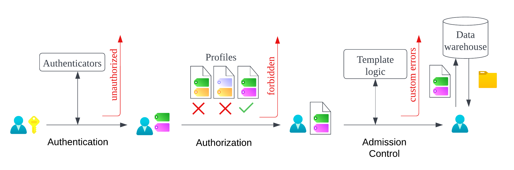

# Access Control

This is an overview of VulcanSQL access control flow:



## Authentication

First, we need to know who sends the request, a common way is validating the credentials like tokens, cookies…etc. This process is done by [Authenticators](./access-control/authenticator), authenticators might validate the credentials themselves, or ask third-party auth providers about them. When the authentication process is fulfilled, we add some “attributes” to the request for the next step, these attributes can be users' names, departments, groups, statuses…etc., which depend on the authenticators.

Please check [Authenticators](./access-control/authenticator) for the authenticators you can use.

## Authorization

After knowing our requesters, we need to determine what they can do, VulcanSQL implemented a simple [attribute-based access control](https://en.wikipedia.org/wiki/Attribute-based_access_control?oldformat=true) (ABAC) for it. We can set the policy on profiles, e.g. the profile “pg-admin” only allows the users who are in the administrator group to access. While evaluating requests, we check whether the attributes of users meet the requirements of profiles. If users can't access any of the profiles, we reject the request with “forbidden” error, otherwise, we give the profile to the request and push them to the next step.

Please check [Authorization](./access-control/authorization) for who to set the policy.

## Admission Control

This step is optional, you may need some complex logic to decide the legality of the request, in these cases, you can check the request in [SQL Templates](./sql-template). For example, assume that we want to limit the size of the result for the requests from interns, we can add the following SQL at the top of our templates:

```sql

	

```

## Fetch data from warehouses

After passing all of the access control steps, users can send queries to warehouses with the profile we gave.
