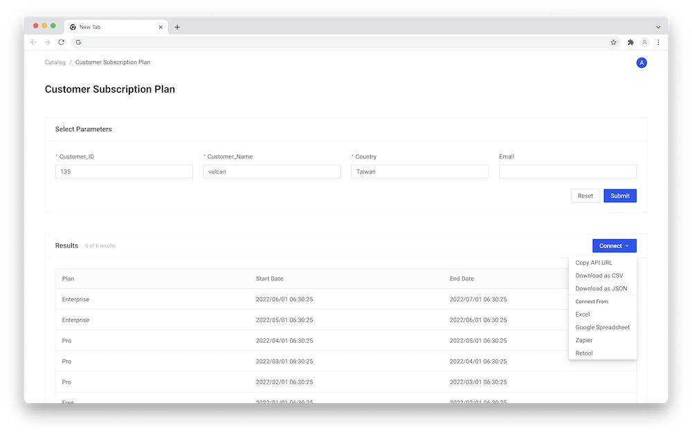

# Introduction

:::caution

This feature has been integrated into our main branch and is set to be unveiled soon in our upcoming release.

:::

VulcanSQL empowers you to construct a self-serve catalog page. A remarkable aspect of this is that **even users lacking SQL knowledge can effortlessly extract data from the API you've crafted.**

## Explore our API Endpoint Listing Page
This page serves as a showcase for all APIs painstakingly prepared by our data analysts and data engineers. It provides a broad overview for users to choose from.

## Dive Deep into our API Endpoint Detail Page
Venturing into a particular API endpoint from the listing page, users will be greeted with extensive details like:
* Column Metadata
* Parameters Metadata

Additionally, users have the freedom to:
* Engage with data in real-time, with the ability to set and tweak filters according to their needs.
* Download data in both CSV or JSON formats.
* Learn and adapt on how to extract data from other applications.

## Seamless Connectivity from Applications
By following the provided instructions, users can effortlessly copy an API link and incorporate it into their applications to fetch the required data.

