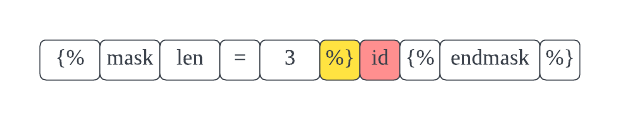
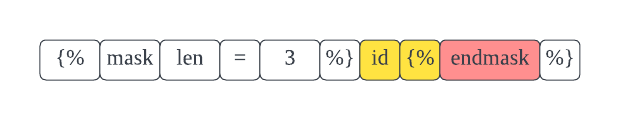

import ASTVisitor from '../partial/_ast-visitor.mdx';
import UseFunctionalTag from './_use_functional_tag.mdx';

# TagBuilder

TagBuilder extension works together with [TagRunner](./tag-runner), it parses the SQL templates and generate an Abstract Syntax Tree (AST).

<UseFunctionalTag />

## How TagBuilder works

You'll need to claim some names first, when the compiler finds a matched name, it calls `parse` function of a specified TagBuilder, the TagBuilder takes the control, parses the template, then gives the control back to the compiler.

For example, assume that we created a TagBuilder with tag name `mask`, it'd parse the template from line 2 ("mask" token).

```sql showLineNumbers
SELECT

id

FROM users
```

## AsyncExtensionNode

You can return any type of AST node you want, but it's more common to return an `AsyncExtensionNode`, it lets VulcanSQL calls [TagRunner](./tag-runner) with some arguments you defined when executing templates.

You should use the protected function `createAsyncExtensionNode` to create a node, it accepts two arguments. The first one is arguments node, which will be rendered before being sent to TagRunner. The second one is content nodes, which will be passed as render functions, they'll be rendered by the TagRunner. There is no constraint for how to use these two kinds of arguments, but you can check the example below to learn how they integrate with templates.

## Example

:::info
You can check the [demo repository](https://github.com/Canner/vulcan-sql-extension-demo/blob/main/extensions/tag-runner-and-builder/src/maskTagBuilder.ts) for the full code.

:::

```ts showLineNumbers
import { TagBuilder } from '@vulcan-sql/core';

export class MaskTagBuilder extends TagBuilder {
  // Claim the tag name, tell us when should we give you the control.
  public tags: string[] = ['mask', 'endmask'];

  // When the target tags are found, we call parse() function, you need to return an AST node
  public parse(parser: any) {
    // SELECT  id  FROM users;

    // Tokens: mask
    // consume mask tag
    parser.nextToken();

    // Tokens: len=3
    // parseSignature is a helper function to parse the arguments of tag
    // e.g. len=3 -> {len: 3}
    const argsNodeToPass = parser.parseSignature(true, true);

    // Tokens: %}
    // consume end tag token
    parser.nextToken();

    // Tokens: id 
    // advanceAfterBlockEnd is a helper function to advance after the end block %}
    parser.advanceAfterBlockEnd();

    return this.createAsyncExtensionNode(argsNodeToPass, [requestQuery]);
  }
}
```

Assume that we're parser the following SQL:

```sql
SELECT  id  FROM users;
```

1. Compiler will tokenize the template as follows:
   
2. When it found target tag names, that is, `mask` in this example. It gives the control to TagBuilder.
   
3. At line 13, we consumed a token, which is a token with string "mask", so the position of parser moves to the next.

   

4. At line 18, we consumed tokens by a helper function `parseSignature` to retrieve the arguments. The first `true` tells compilers no to throw errors when it fails to parse, the second one tells compilers to parse without parentheses (`` instead of ``). These nodes will become arguments node.

   

5. At line 22, we consumded to blockend token `%}`.
   
6. At line 26, we parsed the content unit the token `endmask`. These nodes will be content nodes.
   
7. At line 30, we consumed all the tokens belong to us, then gave the control back.
   

## Advanced: AST Visitor

<ASTVisitor name="TagBuilder" />
