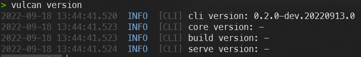
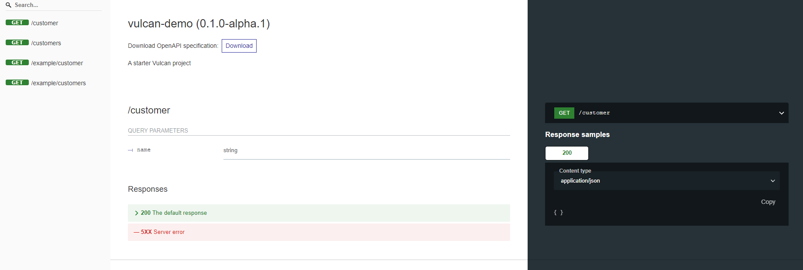
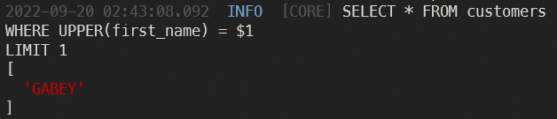
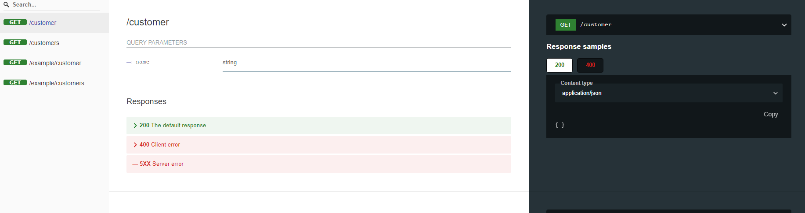
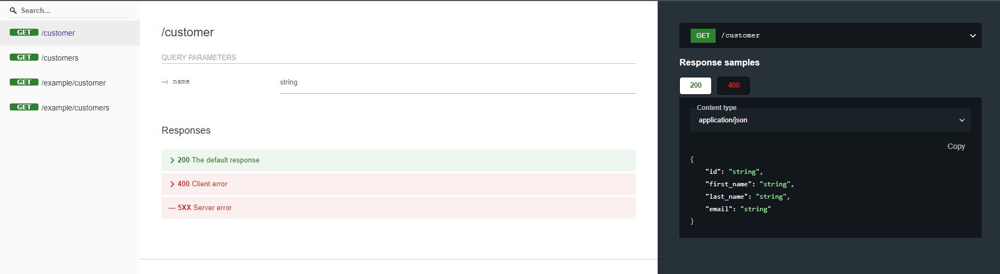
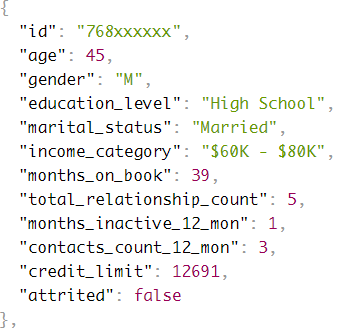

import Tabs from '@theme/Tabs';
import TabItem from '@theme/TabItem';

# Quickstart

Start an API server with sample data in 10 minutes.

You can run this tutorial on Gitpod without any local installation:

[](https://gitpod.io/#https://github.com/Canner/vulcan-demo)

## Requirements

Ensure you have installed one of the following:

- [Node.js](https://nodejs.org/) 16+. You can install multiple node versions via [NVM](https://github.com/nvm-sh/nvm).
- Docker.

## Install VulcanSQL CLI

<Tabs groupId="install-method">
<TabItem value="nodejs" label="With Node JS">

1. Install CLI globally via NPM.

   ```bash
   npm i -g @vulcan-sql/cli
   ```

2. To ensure successful installation, print the version information.

   ```bash
   vulcan version
   ```

   

</TabItem>

<TabItem value="docker" label="With Docker">

1. Pull the CLI image.

   ```bash
   docker pull ghcr.io/canner/vulcan-sql/cli:latest
   ```

2. Set the alias for `vulcan`.

   ```bash
   alias vulcan="docker run -it --rm -p 3000:3000 -v ${PWD}:/usr/app ghcr.io/canner/vulcan-sql/cli"
   alias "vulcan-install"="vulcan-install"="docker run -it --rm -p 3000:3000 -v ${PWD}:/usr/app --entrypoint npm ghcr.io/canner/vulcan-sql/cli install"
   ```

3. To ensure installation, print the version information.

   ```bash
   vulcan version
   ```

   

</TabItem>
</Tabs>

## Start a server from the demo project

1.  Clone the project to your local environment.

    ```bash
    git clone git@github.com:Canner/vulcan-demo.git && cd vulcan-demo
    ```

2.  Install dependencies.

    <Tabs groupId="install-method">

    <TabItem value="nodejs" label="With Node JS">

    ```bash
    npm install
    ```

    </TabItem>

    <TabItem value="docker" label="With Docker">

    ```bash
    vulcan-install
    ```

    </TabItem>

    </Tabs>

3.  Start the server.

    ```bash
    vulcan start --watch
    ```

4.  Open the API documentation with URL: [http://localhost:3000/doc](http://localhost:3000/doc)

    

## Know your data

We used [Kaggle: Credit Card customers](https://www.kaggle.com/datasets/sakshigoyal7/credit-card-customers) as our demo dataset

Here's a scenario using this dataset:

> A manager at the bank is disturbed with more and more customers leaving their credit card services. They would really appreciate if one could predict for them who is gonna get churned so they can proactively go to the customer to provide them better services and turn customers' decisions in the opposite direction

We have two tables in our database from part of this dataset (first 1000 rows):

- [customers](https://github.com/Canner/vulcan-demo/blob/main/data/customers.csv) contains the basic information of our customers
- [churners](https://github.com/Canner/vulcan-demo/blob/main/data/churners.csv) contains their monitoring result, including their age, salary, marital status, etc..., and `attrited` column indicates whether the customer record was attrited or not.

Instead of making predictions, we want to create APIs for further usage, we'll make two APIs in this tutorial:

- `/customer?name=${name}` to query user's basic information.
- `/customers?<filter>` to query users' monitoring results that fit the filter.

## Build APIs with SQL with `customer` table

:::info
At any time you get lost, or you want to see the final result, feel free to check the full examples which are located in [`sqls/examples`](https://github.com/Canner/vulcan-demo/tree/main/sqls/examples) folder.
:::

1.  Open `sqls/customer.sql`, it should already contain a SQL query like the below:

    ```sql
    SELECT * FROM customers
    WHERE UPPER(first_name) = 'LIUKA'
    LIMIT 1
    ```

    We'd like to use the name of the user's input `name` to replace the static string “LIUKA”, so please update the SQL using the [template variable](./api-building/sql-syntax#dynamic-parameter) `{{ context.params.name }}`.

    ```sql
    SELECT * FROM customers
    WHERE UPPER(first_name) = {{ context.params.name }}
    LIMIT 1
    ```

    Your first API with a parameter input is done! Try the API by visiting it:

    - [localhost:3000/api/customer?name=GABEY](http://localhost:3000/api/customer?name=GABEY)
    - [localhost:3000/api/customer?name=KENDELL](http://localhost:3000/api/customer?name=KENDELL)

    <br />

    :::tip
    Is it safe to render data from external sources like the user's input?

    Yes, we'll parameterize all the user input like the below to prevent SQL injections.
    

    Check [Display the variable](./api-building/sql-syntax#display-the-variable--dynamic-parameter) for more information.
    :::

2.  Apply a [filter](./api-building/sql-syntax#filters) to the input, we can to `upper` filter to coerce input into uppercase.

    ```sql
    SELECT * FROM customers
    WHERE UPPER(first_name) = {{ context.params.name | upper }}
    LIMIT 1
    ```

    Now, test with some names in lower case:

    - [http://localhost:3000/api/customer?name=kendell](http://localhost:3000/api/customer?name=kendell)

3.  Next, let's try to throw an error message when user is not found. We can let our API better by showing explicit error messages.
    First, we need to execute an extra query to know whether the user is in our database:

    ```sql
    
    SELECT COUNT(*) AS count FROM customers
    WHERE UPPER(first_name) = {{ context.params.name | upper }}
    

    SELECT * FROM customers
    WHERE UPPER(first_name) = {{ context.params.name | upper }}
    LIMIT 1
    ```

    The block ` ... ` is a [query block](./api-building/predefined-queries) which tells VulcanSQL that we want to save the query result to `user` variable instead of outputting as responses.

    Now we can get the result of this query and throw an error when the result equals `0`.

    ```sql
    
    SELECT COUNT(*) AS count FROM customers
    WHERE UPPER(first_name) = {{ context.params.name | upper }}
    

    
      
    

    SELECT * FROM customers
    WHERE UPPER(first_name) = {{ context.params.name | upper }}
    LIMIT 1
    ```

    We used the if expression to throw an error when the result equals `0`, VulcanSQL server will stop executing and responding immediately when encounter a `` tag, `"CUSTOMER_NOT_FOUND"` is the error code we want to throw the exception.

    :::info
    You can add more information about your errors, e.g. description, HTTP code, etc... Please check [Error responses](./api-building/error-response)

    :::

    You can test with some invalid names:

    - [http://localhost:3000/api/customer?name=some-invalid-name](http://localhost:3000/api/customer?name=some-invalid-name)

4.  Throw an error when the name is ambiguous. We noticed that some customers have the same first name, let's figure them out and throw an error.
    We'll need to use the user's count twice, in order the reuse the result, we need to save the result first.

    ```sql
    
    SELECT COUNT(*) AS count FROM customers
    WHERE UPPER(first_name) = {{ context.params.name | upper }}
    

    

    
      
    

    SELECT * FROM customers
    WHERE UPPER(first_name) = {{ context.params.name | upper }}
    LIMIT 1
    ```

    `` tag saved the result from the right side like most programming languages: `var someVar = someVal`, in this example, we saved the query result into `userCount` variable.

    :::info
    Please save only the data you need in template logic, these data will be stored in VulcanSQL server memory and only exist while the template is rendering.
    Please check [`set` variable](./api-building/sql-syntax#set-variable) for more information.

    :::

    Let's finish the last part: throw `CUSTOMER_IS_AMBIGUOUS` error:

    ```sql
    
    SELECT COUNT(*) AS count FROM customers
    WHERE UPPER(first_name) = {{ context.params.name | upper }}
    

    

    
      
    

    
      
    

    SELECT * FROM customers
    WHERE UPPER(first_name) = {{ context.params.name | upper }}
    LIMIT 1
    ```

    You can test with user `Hayden`

    - [http://localhost:3000/api/customer?name=Hayden](http://localhost:3000/api/customer?name=Hayden)

5.  The last step: Add a [sample request](./api-building/api-document#set-sampler). VulcanSQL is unable to describe our API responses until we give it a sample request. When you open the [API documentation](http://localhost:3000/doc#/paths/~1customer/get), you'll see nothing has been described yet.

    

    Open the file `sql/customer.yaml`, and add a sample request.

    ```yaml
    urlPath: /customer
    profiles:
      - demo
    request:
      - fieldName: name
        fieldIn: query
    sample:                 # Add here!
      profile: demo
      parameters:
        name: 'Liuka'
    ```

    We have the schema for our response now!

    

## Build APIs with SQL with `customers` table

1.  Open `sqls/customers.sql`, it should already contain a SQL query like the below:

    ```sql
    SELECT
      id,
      age,
      gender,
      education_level,
      marital_status,
      income_category,
      months_on_book,
      total_relationship_count,
      months_inactive_12_mon,
      contacts_count_12_mon,
      credit_limit,
      attrited
    FROM churners
    LIMIT 10
    ```

    Let's implement a sample offset and limit pagination:

    ```sql
    SELECT
      id,
      age,
      gender,
      education_level,
      marital_status,
      income_category,
      months_on_book,
      total_relationship_count,
      months_inactive_12_mon,
      contacts_count_12_mon,
      credit_limit,
      attrited
    FROM churners

    OFFSET {{ context.params.offset | default(0) }}
    LIMIT {{ context.params.limit | default(20) }}
    ```

    You can try your API:

    - [http://localhost:3000/api/customers?limit=10](http://localhost:3000/api/customers?limit=10)
    - [http://localhost:3000/api/customers?limit=10&offset=10](http://localhost:3000/api/customers?limit=10&offset=10)

2.  Same as we did at the last API, we can add some conditions for users' inputs:

    ```sql
    SELECT
      id,
      age,
      gender,
      education_level,
      marital_status,
      income_category,
      months_on_book,
      total_relationship_count,
      months_inactive_12_mon,
      contacts_count_12_mon,
      credit_limit,
      attrited
    FROM churners

    WHERE
    age > {{ context.params.age_gt | default(0) }}

    
    AND gender = {{ context.params.gender | upper }}
    

    
      
      AND attrited = {{ attrited }}
    

    OFFSET {{ context.params.offset | default(0) }}
    LIMIT {{ context.params.limit | default(20) }}
    ```

    We use `default` filter here to set the fallback value. When users don't send a parameter, we use the default value.

    Unlike the last API, we use `` expression the determine whether render the SQL or not, the queries in if blocks are only sent when the condition is satisfied.

    You can try this API with different parameters to see the queries changed:

    - [localhost:3000/api/customers?age_gt=45](http://localhost:3000/api/customers?age_gt=45)
    - [localhost:3000/api/customers?age_gt=45&gender=m](http://localhost:3000/api/customers?age_gt=45&gender=m)
    - [localhost:3000/api/customers?age_gt=45&gender=m&attrited=yes](http://localhost:3000/api/customers?age_gt=45&gender=m&attrited=yes)

3.  Let's finish the tutorial with a cool feature: Render by users' attribute. Assuming we don't want to show the id of the customer to all people because it might be sensitive, we can mask it when the API requester is not an administrator.
    You can use your own authenticators for your organization, please check [Authenticator section](./api-building/access-control/authenticator) for further information. In this tutorial, we use a mock authenticator: You can simply be authenticated by adding `user` parameter, e.g. [localhost:3000/api/customers?user=tom](http://localhost:3000/api/customers?user=tom)
    We've set two users and their groups in the config:

    ```yaml
    - name: may
      attr:
        group: engineer
    - name: tom
      attr:
        group: admin
    ```

    Now we want to mask the id column when the user's attribute is not an `admin`:

    ```sql
    SELECT
      
        id
      
        CONCAT(SUBSTR(id, 0, 4), 'xxxxxx')
       as id,
      age,
      gender,
      education_level,
      marital_status,
      income_category,
      months_on_book,
      total_relationship_count,
      months_inactive_12_mon,
      contacts_count_12_mon,
      credit_limit,
      attrited
    FROM churners

    WHERE
    age > {{ context.params.age_gt | default(0) }}

    
    AND gender = {{ context.params.gender | upper }}
    

    
      
      AND attrited = {{ attrited }}
    

    OFFSET {{ context.params.offset | default(0) }}
    LIMIT {{ context.params.limit | default(20) }}

    ```

    You can try this API with different users:

    - [localhost:3000/api/customers?user=tom](http://localhost:3000/api/customers?user=tom)
    - [localhost:3000/api/customers?user=may](http://localhost:3000/api/customers?user=may)

    
