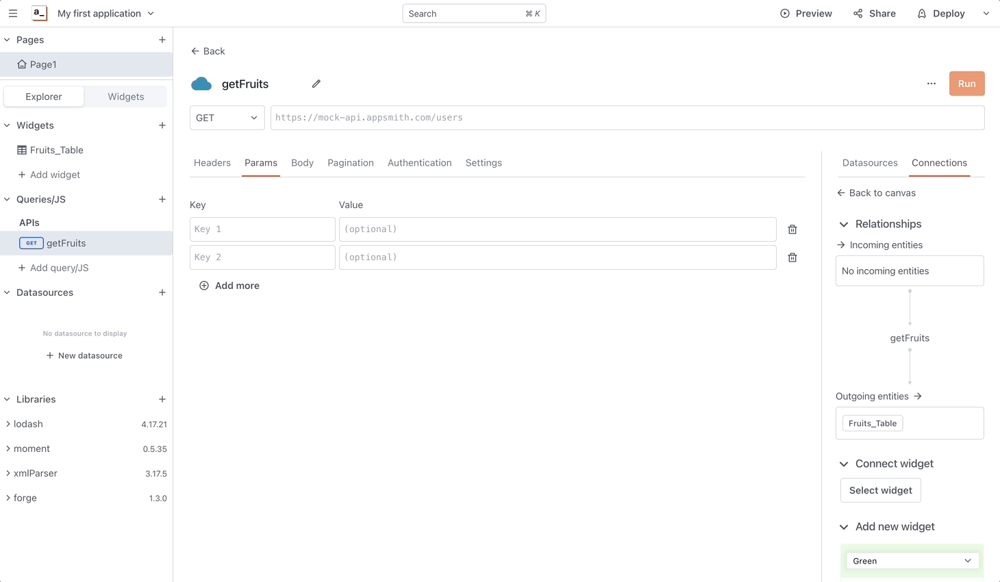
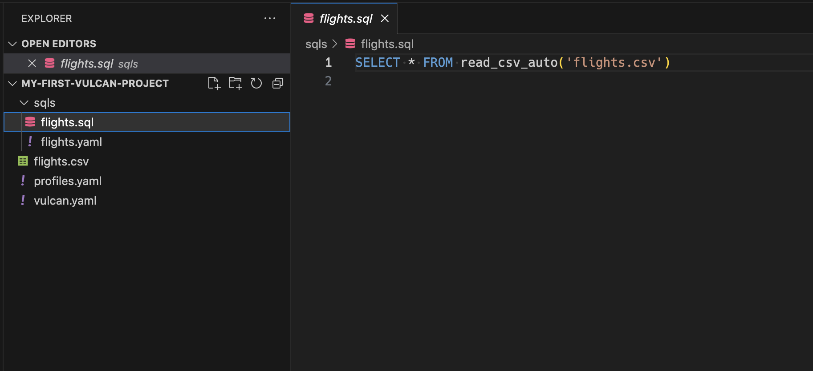
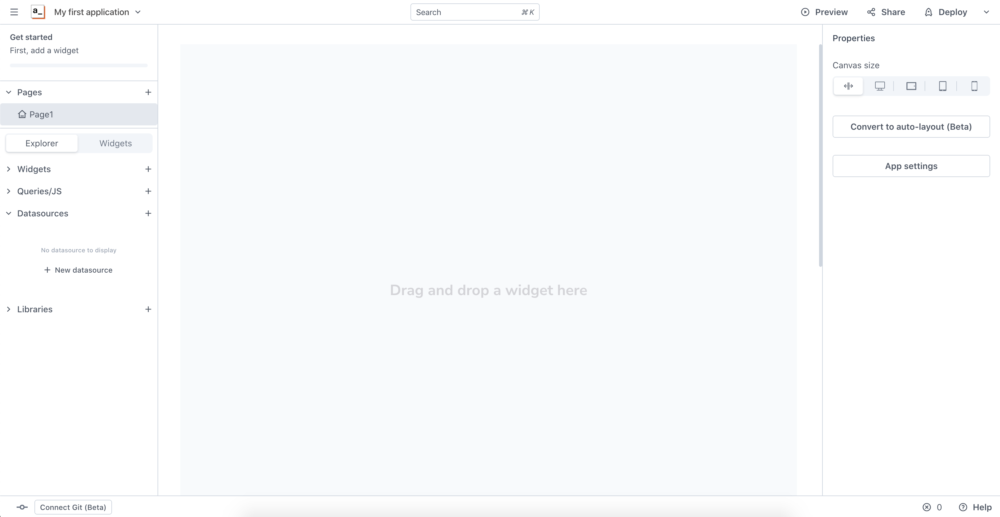
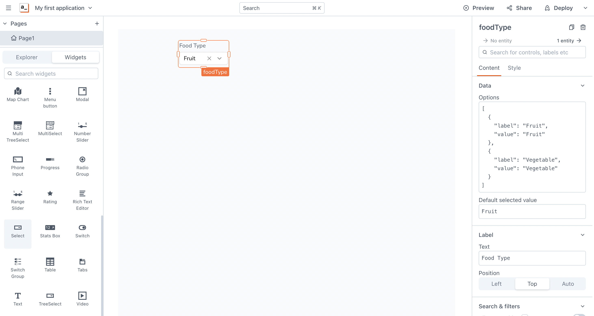
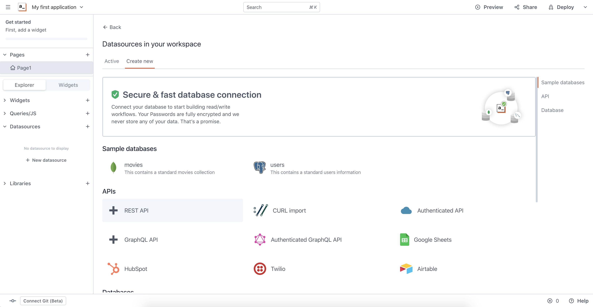
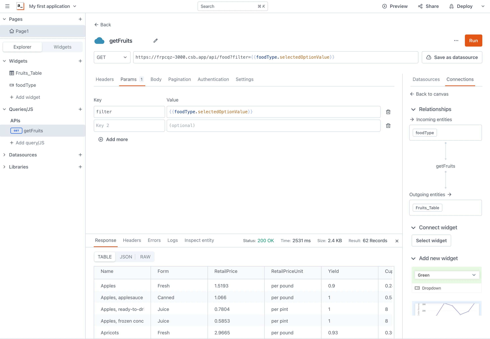
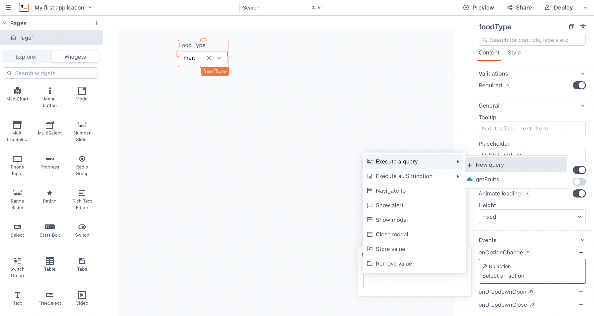

# Making of database GUI in Appsmith

## Introduction

In this demo, we'll showcase how VulcanSQL and Appsmith make it effortless to create a Data API and build a application. Appsmith is a powerful open-source developer tool that simplifies the creation of internal tools like dashboards and database interfaces. With drag-and-drop functionality, Appsmith enables fast and customizable UI design. By combining VulcanSQL's Data API with Appsmith, you can quickly develop and deploy user-friendly applications.



## The Difficulties

#### Managing access and preventing information leakage
Table sharing should be managed in a secure manner to limit access to all data and prevent the spreading of sensitive information. It is crucial to ensure the confidentiality, integrity, and availability of data throughout its lifecycle.

#### Data lake or data warehouse not suitable for applications
Data lakes and data warehouses may not be ideal for applications that require fast and frequent data access. Users today expect quicker and more frequent access to data for real-time analytics and data-driven decision-making.

#### Hard to control cost
One of the challenges with frequent and fast data access is the increased cost associated with it. Processing large volumes of data and providing real-time access can lead to higher infrastructure costs and resource utilization. Organizations need to carefully optimize their data access strategies to balance the need for speed with cost efficiency.


## Why VulcanSQL

#### Data access restrictions
With VulcanSQL's [dynamic parameter](/docs/develop/dynamic-param) feature, users have precise control over the data they access. This enhances data privacy and reduces data transfer, improving efficiency and security. Moreover, VulcanSQL's [data privacy handling](/docs/data-privacy/overview) ensures the protection of sensitive information through encryption and access control.

#### Enhance performance with caching mechanism
To address the challenges of high-concurrency and low-latency, VulcanSQL implements a caching mechanism using DuckDB. This caching layer allows VulcanSQL to synchronize data from DuckDB and serve it to users without the need to repeatedly connect to the data source.

#### Optimize cost with caching layer
By leveraging the DuckDB caching layer, VulcanSQL significantly reduces the need to fetch data from the data warehouse for most queries. This results in cost savings as it minimizes the resources consumed by querying the data warehouse. Instead, VulcanSQL can retrieve the data directly from the DuckDB cache, which offers faster access and eliminates the need for frequent queries to the data warehouse. This caching mechanism improves performance and helps optimize costs in data retrieval and processing.


## Prerequistes
To successfully finish this guide, you'll need:
- Install VulcanSQL ([Installation](/docs/get-started/installation))
- Appsmith account ([Register Appsmith Cloud](https://app.appsmith.com/))


## Demo: VulcanSQL + Appsmith

### Set up your VulcanSQL starter project

First, you need to follow the instruction to create an init template:
https://vulcansql.com/docs/develop/init

Here's what it will look like:



In this case, we will use `food_prices_2020.csv` to practice.


### Write your SQL query
With VulcanSQL's filtering feature, you have the ability to selectively expose specific data to your application. In our example, we have a dataset called food_prices_2020.csv, but we only want to present the fruit prices. To achieve this, we can dynamically add a parameter called `filter` to specify the desired data filtering. 

In `food.yaml`, we define the parameter we need to pass in the request:
```yaml
urlPath: /food
request:
  - fieldName: filter
    fieldIn: query
    description: filter Fruit or Vegetable
sample:
  profile: duckdb
profiles:
  - duckdb
```

In `food.sql`, we can use the `if/endif` syntax to query the data conditionally.

```sql
SELECT * FROM read_csv_auto('data/food_prices_2020.csv')

    WHERE type = {{context.params.filter}}

```

Adding parameters to our data operations provides a quick and semantic way to control and filter the accuracy of the data. By specifying parameters, we can precisely retrieve the desired information and ensure that the results are tailored to our specific requirements. 

#### For those datasource on cloud:

In high-concurrency and low-latency scenarios, VulcanSQL offers a caching mechanism for datasources stored in data warehouses or data lakes. By caching datasets, the frequency of retrieving data from the original source is reduced, resulting in improved performance. To learn more about VulcanSQL's caching functionality and its usage, refer to the documentation on [Caching Datasets](/docs/develop/cache).

It can just as simple to use `cache/endcache` syntax:

```sql

SELECT * FROM cached_food

    WHERE type = {{context.params.filter}}


```

### Set up Appsmith Application
Now we start to set up Appsmith.

After creating an Appsmith account, it will directly help create and navigate to `My first application`.



We add a select **Widget** to canvas and name it `foodType` to prepare the parameter for **REST API** in next step.
In the **Options** section, we add the value `Fruit` and `Vegetable` for filtering the data and set default selected value to `Fruit`.
Name the select label to `Food Type`.



Then, we select **+ New datasource** on the sidebar in tab **Explorer**. Appsmith provides datasources for developers. In this case, we choose **REST API** for using VulcanSQL Data API as datasource.



After navigate to the **Queries/JS** section, we edit the name to `getFruits`. Add the API that was created in VulcanSQL previously. Include the dynamic parameter `{{foodType.selectedOptionValue}}` in the filter key value. This will enable the API to interact with the food type selection.




Back to the select, we need to add the event to interact with the API's filtering parameter. Scroll down to the **Events** section and
add an event to **onOptionChange**, choose **Execute a query** > `getFruits`.



After setting up the datasource, we can drag a **Table** to canvas and select `getFruits` in the table data on the right sidebar. As you complete, you can click the **Deploy** button on the right top of the screen to deploy the application and test it in the view mode.


Here's the deployed result.


## Conclusion

That's it! This concludes our simple example: [Vulcan+Appsmith Demo](https://app.appsmith.com/app/my-first-application/page1-64a6848a4d60e87c5655e3f6).

To ensure a fast and seamless experience, we invite you to try out our [VulcanSQL Demo](https://codesandbox.io/p/sandbox/demo-for-appsmith-frpcqz) template on CodeSandbox. By using VulcanSQL and Appsmith, you can fully experience their powerful capabilities. Enjoy the benefits and efficiency that VulcanSQL and Appsmith bring to your data operations.

:::info
We have a [Discord community](https://discord.gg/ztDz8DCmG4) and welcome to ask us anything or give us feedback! Also, we definitely welcome you to share interesting projects you've done using VulcanSQL in [#showcase](https://discord.com/channels/1017514410677391420/1017514410677391427) channel!

Finally, if VulcanSQL resonates with you, please consider starring us on GitHub!
:::