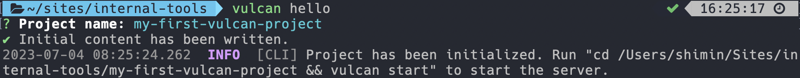

# Making a database GUI in Appsmith 

In this case, we will show how easy that VulcanSQL create a Data API and build a dashboard by Appsmith. We are going to use VulcanSQL Data API as a datasource to Appsmith and quickly build and deploy a database GUI.

## Introduction
Allow me to quickly introduce what Appsmith is, especially for those who may be unfamiliar with this tool. Appsmith is an open source developer tool that help rapid creation of internal tools, including dashboards, database GUIs, admin panels etc. You can drag and drop pre-built widgets to effortlessly build UI on a grid-style canvas.

## Installing VulcanSQL
First, we need to install binary from [VulcanSQL Installation](https://vulcansql.com/docs/get-started/installation#install-from-binary). 

After installation, create an project by the command line below:
```bash
vulcan hello
```

You can name the project folder, for example:  `my-first-vulcan-project`.



By default, its already have the example `flights.csv` datasets and sql template like below:


In the project folder, start the VulcanSQL server by using the command line below:
```bash
vulcan start
```

Now, we can request the example Data API by [http://localhost:3000/api/flights](http://localhost:3000/api/flights).

Let's start to install Appsmith in the next step!

## Installing Appsmith
You can set up Appsmith whether with self-hosted or cloud. In this case, we will use self-hosted version of Appsmith as an example. We will need docker to help us starting an appsmith server.

First, we need to download `docker-compose.yml` , it can be find the reference in the [installation guides](https://docs.appsmith.com/getting-started/setup/installation-guides/docker#install-appsmith) of Appsmith.


1. Create a folder named `appsmith` on your machine for deployment and data storage. Then, navigate to this folder using the `cd` command and follow the steps below:

  ```bash
  curl -L https://bit.ly/docker-compose-CE -o $PWD/docker-compose.yml
  ```

2. Start the Docker container using the following command. You may need to run with `sudo` if you don't have permission to run `docker-compose`.

  ```bash
  docker-compose up -d
  ```

  If the image doesn't exist locally, this command downloads the necessary Docker image and starts the container.

3. Open [https://localhost](https://localhost/) and wait for the server to come up. This can take up to 5 minutes. Once the server is up and running, you can access Appsmith at [https://localhost](https://localhost/).

  For the first time open [http://localhost](http://localhost), appsmith will ask you to create an account to continue.

## Making a database GUI
After create an account, it will directly help create and navigate to `My first application`.


Then, we select **+ New datasource** on the sidebar in tab **Explorer**. Appsmith provides several types of datasource for developers. In this case, we choose **REST API** for using VulcanSQL Data API as datasource.


It will navigate to **Queries/JS** section, then we edit the name to `getFlights` and add the flights API that we created in VulcanSQL before.

> As you can see in below image, we need to change http://localhost:3000 to http://docker.for.mac.localhost:3000 since the self-hosted Appsmith is running in docker.


Now, done setting up the datasource, we can drag a **Table** to canvas and select `getFlights` in the table data on the right sidebar. As you have completed, you can click the **Deploy** button on the right top of the screen to deploy the application and test it in the view mode.


That's it, this easy example is complete. You can use the widgets that Appsmith provided to build an internal tool that you needed. Enjoy the powerful of VulcanSQL and Appsmith.
